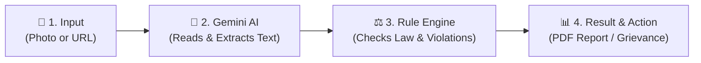
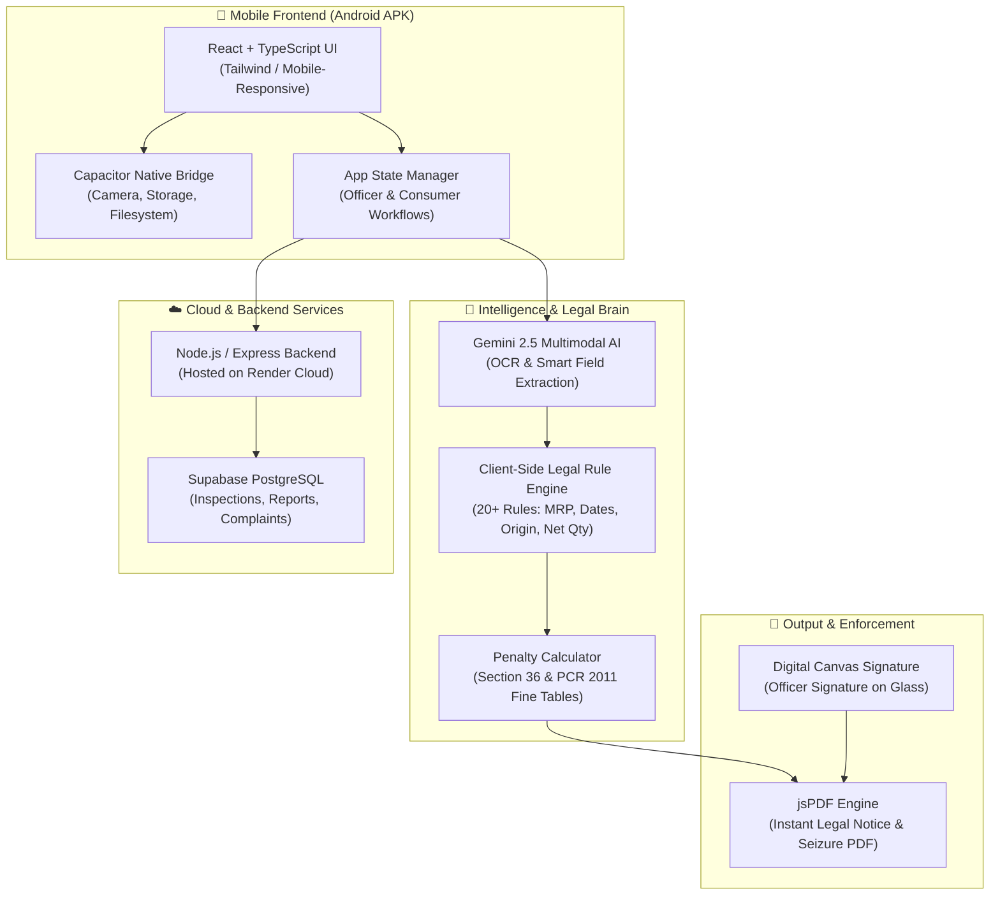

# MANAK: AI-Powered Legal Metrology Compliance Checker
## Presentation & Technical Architecture (Slide-by-Slide Deck)

---

## Slide 1: Title Slide

### **MANAK (मानक)**
#### *Automated Legal Metrology Compliance at Your Fingertips*
- **Problem Statement**: SIH26034 — Smart India Hackathon
- **Focus**: Verifying packaged commodities & e-commerce listings against Legal Metrology (Packaged Commodities) Rules, 2011
- **Target Users**: Enforcement Officers & Common Consumers

> **Speaker Note / 30-Second Pitch:**
> *"Every packaged item we buy—in stores or online—is legally required to show mandatory declarations like MRP, expiry date, manufacturer info, and country of origin. Right now, checking these manually takes officers 15-20 minutes per product, and consumers have no easy way to know if a product is compliant. MANAK automates this in under 5 seconds using AI and a deterministic legal rule engine."*

---

## Slide 2: The Real-World Problem

### What is the issue today?
1. **Manual & Slow**: Field enforcement officers have to physically read tiny text on labels and consult legal books manually.
2. **E-Commerce Explosion**: Millions of online listings (Amazon, Flipkart, Blinkit) violate mandatory declarations (Rule 6(10) of PCR 2011) without detection.
3. **Consumer Vulnerability**: Consumers often get duped by hidden weights, missing expiry dates, or misleading dual-unit pricing.
4. **Paper-Heavy Process**: Generating inspection notices, seizure reports, and penalty orders takes hours of manual paperwork.

---

## Slide 3: The Solution — MANAK

### A Single Mobile App with Two Smart Personas:

| Feature | 👮 Officer Persona | 👥 Consumer Persona |
|---|---|---|
| **Primary Goal** | Fast inspection & legal enforcement | Consumer safety & transparency |
| **Physical Scan** | Camera scan of physical product labels | Easy camera scan to verify product before buying |
| **URL Scan** | Audit e-commerce product listings | Paste link to verify seller declarations before ordering |
| **Output** | Full legal audit, penalty breakdown, sign & export PDF report | Simple "Safe / Risk" badge, easy grievance filing |

---

## Slide 4: High-Level Architecture (In Simple Words)

How does MANAK work under the hood? Think of it in **4 simple steps**:



1. **Step 1: Input** — Officer or consumer takes a photo of a label or pastes an e-commerce link.
2. **Step 2: AI Reader** — Google Gemini AI reads the image or web page and extracts key details (MRP, Net Qty, Dates, Manufacturer, Country).
3. **Step 3: Legal Rule Engine** — A built-in legal brain matches extracted data against 20+ statutory rules of Legal Metrology.
4. **Step 4: Action** — Instantly displays a green/red scorecard, calculates exact legal penalties, and generates an official signed PDF report.

---

## Slide 5: Detailed Technical Architecture Diagram



---

## Slide 6: The 5 Core Building Blocks

### 1. 📱 Frontend (User Experience)
- Built with **React and TypeScript** for speed and reliability.
- Packaged as a native Android app using **Capacitor**.
- Works smoothly on any standard Android smartphone — no special hardware needed.

### 2. 👁️ The "Eyes": Multimodal AI (Google Gemini)
- Instead of traditional clunky OCR that fails on curved, shiny, or crinkled packaging, we use **Gemini Vision AI**.
- It understands context: It doesn't just read "₹199", it knows it's the **MRP**, detects whether inclusive of all taxes, and checks if unit sale price is present.

### 3. ⚖️ The "Brain": Deterministic Legal Rule Engine
- AI *extracts* the text, but a **strict TypeScript rule engine** judges legality.
- Why? AI can hallucinate; statutory law cannot.
- Encodes 20+ statutory checks from **Legal Metrology (Packaged Commodities) Rules, 2011**:
  - Rule 6(1)(a): Name & Address of Manufacturer / Packer / Importer
  - Rule 6(1)(b): Country of Origin
  - Rule 6(1)(c): Net Quantity in standard units (g, kg, ml, l)
  - Rule 6(1)(d): Month & Year of Manufacture / Pre-packing / Expiry
  - Rule 6(1)(da): Maximum Retail Price (MRP inclusive of all taxes)
  - Rule 6(1)(e): Consumer Care Details (Phone & Email)
  - Rule 6(10): Mandatory disclosures on e-commerce marketplaces

### 4. ⚡ Offline-First Architecture
- Officers often inspect remote godowns, village markets, or basements with zero mobile network.
- MANAK is built with **smart fallback**:
  - If the cloud backend is unavailable, the app automatically switches to direct client-side processing.
  - Field work never stops.

### 5. 📑 Instant Legal Documentation (PDF Generator)
- Built-in `jsPDF` engine creates official, court-admissible inspection notices right on the phone.
- Officers can sign directly on the screen using digital canvas signatures.
- Includes timestamp, GPS coordinates, violation photographs, and statutory penalty amounts.

---

## Slide 7: How the E-Commerce URL Scanner Works

A unique standout feature for checking online market places:

```
[Paste Amazon/Flipkart URL]
          ↓
[Automated Fetch / Scraping Service]
          ↓
[Gemini AI analyzes product page images + spec table]
          ↓
[Rule 6(10) Legal Compliance Engine evaluates 20 checks]
          ↓
[Instant Report: Missing Country of Origin / Missing MRP / Non-compliant Seller]
```

- **Problem it solves**: Over 30% of online listings miss mandatory details like manufacturer address or consumer care email.
- **Consumer benefit**: One click tells them if the seller is legally registered and genuine.
- **Officer benefit**: Enables rapid mass-audits of digital marketplaces without manual browsing.

---

## Slide 8: Technology Stack Summary

| Layer | Technology Used | Why We Chose It |
|---|---|---|
| **Mobile App** | React, TypeScript, Capacitor | High performance, single cross-platform codebase, native device access |
| **Styling & UI** | Tailwind CSS / Lucide Icons | Clean, modern, high-contrast UI readable under direct sunlight |
| **Vision & AI** | Google Gemini Vision AI | Reads complex curved packaging, multiple languages, low-light photos |
| **Compliance Engine** | Custom TypeScript Rules | 100% deterministic, transparent, court-admissible logic |
| **Cloud Backend** | Node.js, Express (Render) | Lightweight, scalable REST API |
| **Database** | Supabase (PostgreSQL) | Secure cloud storage, real-time audit trail, role-based access |
| **Reports** | jsPDF & HTML5 Canvas | Zero-dependency client-side PDF generation & touch signature |

---

## Slide 9: Key Innovations & Differentiators

1. **AI Extraction + Deterministic Validation**:
   - Best of both worlds: AI handles chaotic visual text, while hard-coded legal algorithms ensure strict statutory accuracy.
2. **Dual Perspective (Officer + Consumer)**:
   - Not just an enforcement tool; also an empowering consumer-protection tool.
3. **Works Anywhere (Zero Network Fallback)**:
   - Inspection doesn't fail in basement warehouses.
4. **Speed & Efficiency**:
   - Reduces inspection-to-notice time from **20 minutes to under 5 seconds**.
5. **No Bulky Hardware**:
   - Turns any standard Android phone into an enforcement workstation.

---

## Slide 10: Future Roadmap & Scalability

- **Batch URL Auditing**: Crawling thousands of e-commerce listings overnight for bulk legal notices.
- **Vernacular Language Support**: Multi-lingual label reading across Indian regional languages.
- **Direct National Consumer Helpline Integration**: One-click forwarding of complaints to statutory grievance portals (NCH/INGRAM).
- **Barcode & QR Verification**: Instant cross-referencing against GS1 India and National Registry.

---

## Slide 11: Conclusion & Q&A

### **MANAK: Protecting Consumer Rights & Empowering Enforcement**
- ✅ Transparent
- ✅ Instant
- ✅ Legally Sound
- ✅ Ready to Deploy (Live Android APK available)

**Thank You!**  
*Open for Questions & Live Demonstration.*
